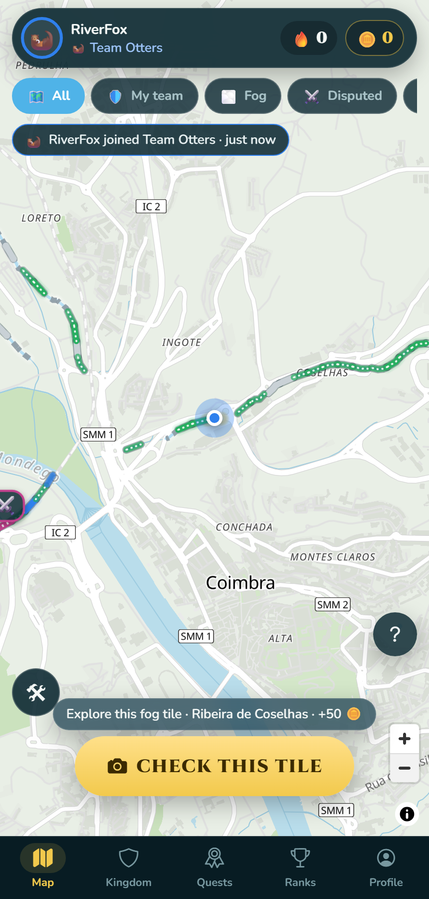
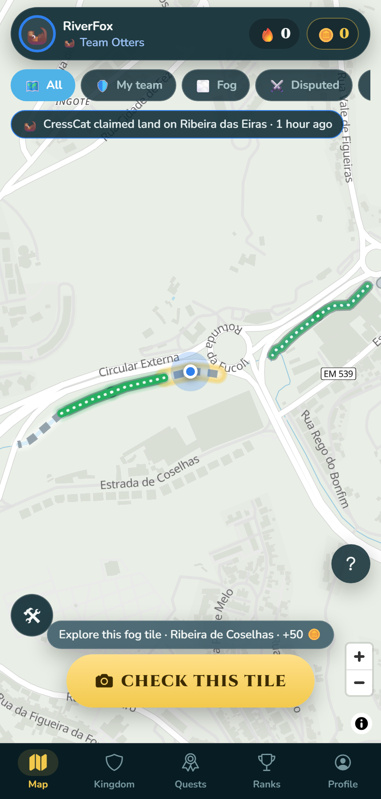
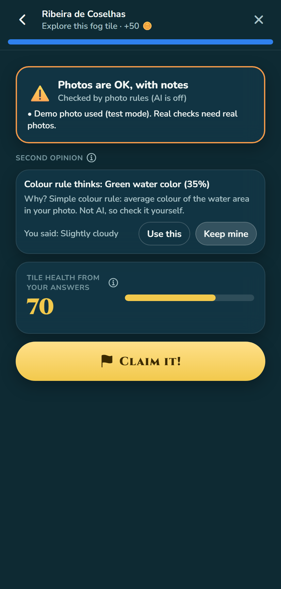
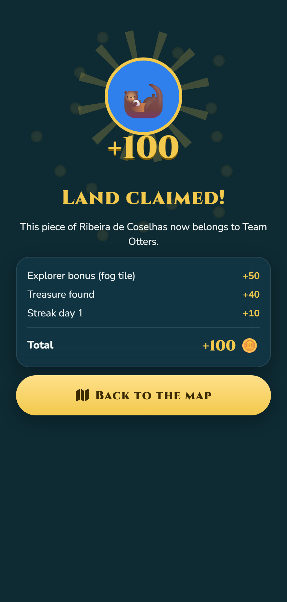
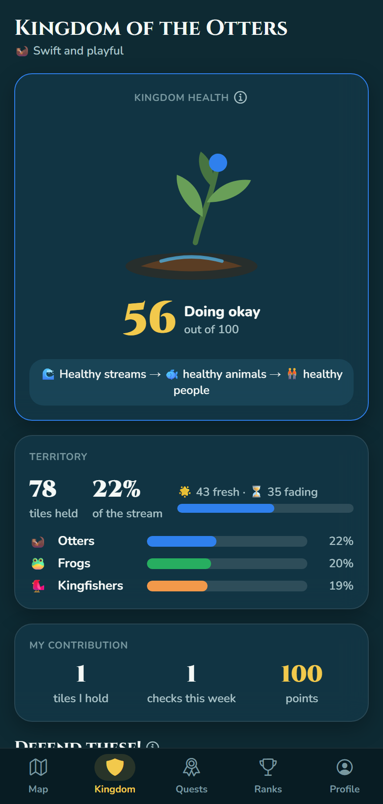
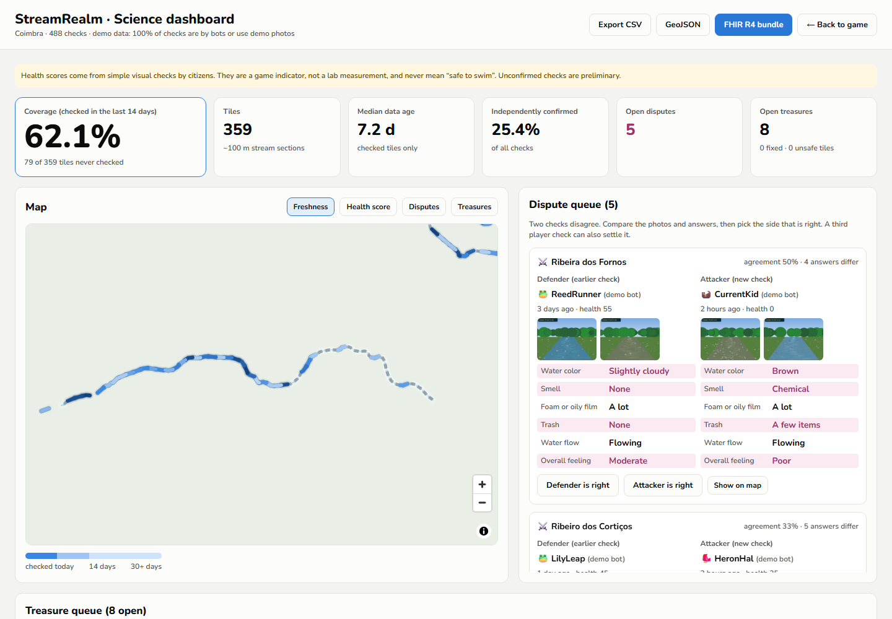
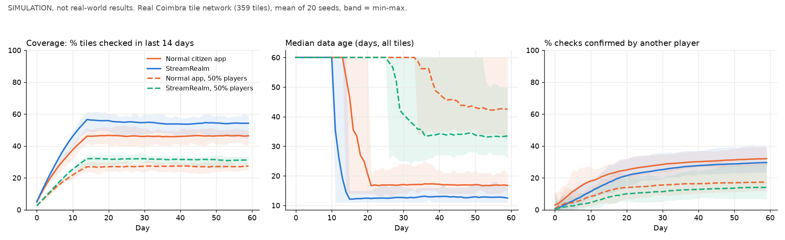
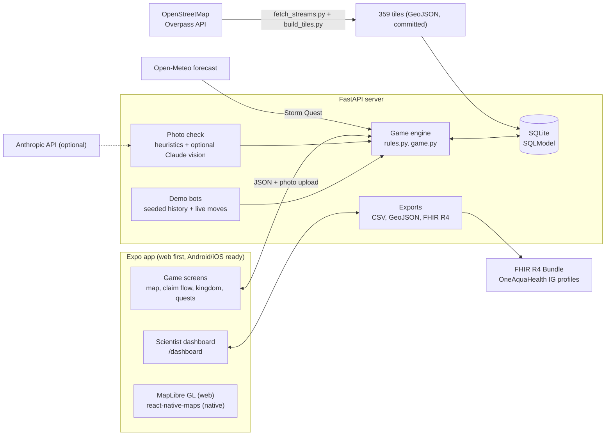

# 🌊 StreamRealm

**Conquer your city stream. Help scientists protect it.**

StreamRealm is a territory game (like Pokémon GO or Ingress) for the **OneAquaHealth IEEE Global Hackathon 2026, Track 5: Community & Gamification**. Citizens claim 100 m pieces of a real city stream by doing a quick photo check. The game rules are secretly a scientific sampling plan.



| Claim a tile | Photo check (you decide) | Victory | Kingdom |
|---|---|---|---|
|  |  |  |  |



    

---

## 1. Track alignment

**Track 5, Community & Gamification (primary).** The problem is low repeat engagement. StreamRealm gives people a reason to come back: their land fades after 7 days, other teams attack it, quests reset every day, and streaks grow.

It also touches three other tracks:

- **Track 3, AI with a human in the loop.** Every check runs a photo check: blur, light, re-used photos, photo age, and (with an API key) Claude vision suggestions. The AI never changes an answer. The player sees chips like "AI thinks: a little foam (70%). Why? …" and taps **Use this** or **Keep mine**. Both answers are stored, so disagreement between people and AI is measurable.
- **Track 6, storm events.** A **Storm Quest** starts when the Open-Meteo forecast shows 10 mm of rain or more in the next 48 h. All points are doubled, because after heavy rain sewers can overflow and data is most valuable.
- **Track 7, interoperability.** One click exports a **FHIR R4 Bundle** that uses the profiles of the HL7 Europe OneAquaHealth IG (`LocationOah`, `ObservationIndicatorsOah`). We checked it with the official HL7 validator: **0 errors** (details in [docs/architecture.md](docs/architecture.md#fhir-export)).

## 2. The problem

Citizen science apps for streams have four common problems:

1. **Low repeat engagement.** People try once and do not come back.
2. **Uneven coverage.** Volunteers check the same easy spots again and again. Long parts of the stream are never seen.
3. **Stale data.** A check from two months ago says little about the stream today.
4. **Unverified reports.** One person's answer is hard to trust without a second opinion.

## 3. The solution: the game rules are secretly a sampling plan

| Game rule | What the player feels | What scientists get |
|---|---|---|
| 🌫️ **Fog** tiles give +50 (Explorer bonus) | "New land to discover!" | Checks in places nobody has visited (**coverage**) |
| ⏳ Land **fades** after 7 days and is lost after 14 | "I must defend my land" | Regular **repeat checks**, fresh data |
| ⚔️ **Attacking** an enemy tile is a full new check | "Let's take their land" | An **independent second check**; if it agrees, the first check is **confirmed** ✅ |
| ⚖️ **Disputes** when two checks disagree | "Who is right? Let's settle it" | A **third check** (or a scientist) resolves conflicting data |
| ⛈️ **Storm Quest** ×2 after heavy rain | "Double points, go now!" | Data at the **most important time** (sewer overflows) |
| 💎 **Treasures** (+40): pipe, trash, wildlife, plant, algae | "I found something!" | A **queue of real problems** and wildlife sightings |
| 🌱 **Kingdom health** grows when problems are **fixed** | "Our streams are healing" | Feedback loop: reports → city action → visible result (One Health) |
| 🔥 Streaks, daily quests, team challenge | "One more day!" | **Sustained participation** |

## 4. How to play (5 steps)

1. **Pick a team**: 🦦 Otters, 🐸 Frogs or 🐦 Kingfishers. Use a nickname, never your real name.
2. **Walk to the stream.** When you are within 40 m of a tile, the big **CHECK THIS TILE** button appears.
3. **Do the stream check**: safety tap, a photo upstream, a photo downstream, 5 easy questions (colour, smell, foam, trash, flow) and your overall feeling (good / moderate / poor). Add a treasure if you found one.
4. **See the photo check.** Accept or ignore the suggestions. You decide.
5. **Claim it!** Your tile paints in your team colour. Come back before it fades, and watch the other teams.

## 5. Coverage experiment (simulation, not real-world results)

`scripts/simulate_coverage.py` runs two worlds for 60 days on the **real 359 Coimbra tiles**, with the **same 24 players, the same homes, the same 18 checks per day and the same walking range**. Both worlds share a strong preference for 3 popular access points. The only difference: in StreamRealm that preference is multiplied by the game incentives. Mean of 20 random seeds; the shaded band is min-max.



| Day 60 (mean of 20 runs) | Normal citizen app | StreamRealm |
|---|---|---|
| Coverage (tiles checked in last 14 days) | **46%** (range 41-50%) | **54%** (range 44-59%) |
| Median data age, all tiles | 16.8 days | **12.5 days** |
| Checks confirmed by another player | **32%** | 30% |
| Sensitivity: 50% fewer players, coverage | 27% | **31%** |
| Sensitivity: 50% fewer players, median data age | 42.5 days | **33.5 days** |

**What this says, honestly:**

- In this model, the incentives spread the same effort over more of the stream (+8 points of coverage) and keep data younger (about 4 days fresher). The effect also shows with half the players.
- The effect is **modest**, and the seed ranges overlap.
- StreamRealm did **not** produce more confirmations. When people spread out, fewer of them check the same spot twice. Attacks and disputes create second checks, but in this model that does not beat everyone crowding the same popular spots.
- The model has **no churn**: players never quit in either world. The main claim of Track 5 (people come back more) is **not** tested here. That needs a real pilot.

All assumptions are listed in the script, in `server/data/experiment/coverage.json`, and on the dashboard. We did not tune the model to get a result.

## 6. Architecture



**Tech stack**

- **App:** Expo SDK 57, TypeScript, expo-router, zustand, TanStack Query, react-native-reanimated, MapLibre GL JS 5 (web), react-native-maps (native), Turf, react-native-svg, Cinzel + Nunito fonts.
- **Server:** Python 3.11+ (tested on 3.14), FastAPI, SQLModel + SQLite, Pillow, ImageHash, OpenCV, Shapely, httpx, Anthropic SDK (optional), matplotlib.
- **Tests:** Jest (17 game-rule tests), pytest (27 tests), an API smoke test, and a Playwright screenshot run.

More detail: [docs/architecture.md](docs/architecture.md) · rules and numbers: [docs/game-design.md](docs/game-design.md) · choices: [docs/DECISIONS.md](docs/DECISIONS.md).

## 7. Run it locally

You need **Node.js 20+** and **Python 3.11+**.

**Windows (PowerShell)**

```powershell
./dev.ps1
```

**macOS / Linux**

```bash
./dev.sh
```

Both scripts create the Python virtual environment, install packages the first time, start the API on **http://localhost:8000** and open the Expo web app (press `w` if the browser does not open; it runs on **http://localhost:8081**).

**By hand, or with make**

```bash
make setup      # once: venv + pip install + npm install
make server     # terminal 1: uvicorn app.main:app --reload --port 8000
make app        # terminal 2: npx expo start --web
make test       # pytest + tsc + jest
```

On first start the server creates `server/data/streamrealm.db` and seeds the demo world (24 bots, 3 weeks of history). The seed takes about 5 seconds.

**Environment variables (all optional)**

| Variable | Default | What it does |
|---|---|---|
| `EXPO_PUBLIC_API_URL` | `http://localhost:8000` (Android emulator: `http://10.0.2.2:8000`) | Where the app finds the server |
| `ANTHROPIC_API_KEY` | empty | Turns on the Claude vision photo check. Without it, heuristics only. Nothing breaks. |
| `ANTHROPIC_MODEL` | `claude-opus-5` | Model for the photo check, e.g. `claude-haiku-4-5` for faster, cheaper checks |
| `AI_TIMEOUT_S` | `8` | After this, the check falls back to heuristics |
| `STREAMREALM_SEED_DEMO` | `1` | `0` starts with an empty world |
| `STREAMREALM_SEED_CITY` | `coimbra` | The only city where demo bots play |
| `EXPO_PUBLIC_CITY` | `coimbra` | Which city the app shows (a key from `server/data/cities.json`) |

Copy `server/.env.example` if you like; the server reads normal environment variables.

**Use a stream near you (for filming the demo)**

```bash
server/.venv/Scripts/python scripts/fetch_streams.py --name mystream --bbox -8.43,40.21,-8.38,40.23   # macOS/Linux: server/.venv/bin/python
server/.venv/Scripts/python scripts/build_tiles.py --city mystream
```

Then restart the server and start the app with `EXPO_PUBLIC_CITY=mystream` (PowerShell: `$env:EXPO_PUBLIC_CITY="mystream"`). A new city starts as all fog, with no bots: perfect for filming your own first claim.

### Dev Panel guide for judges (no phone needed)

Open the 🛠 button on the map (bottom left). It is on by default and can be hidden in **Profile → Dev Panel**.

| Control | Use |
|---|---|
| **Teleport on click** | Click anywhere on the map to stand there. Or open a tile and press **Teleport here (Dev)**. |
| **W A S D / arrow keys** | Walk 10 m per press (Shift = 40 m). |
| **Time Warp** slider (+0 to +30 days) | Moves the game clock forward. Watch tiles go fresh → fading (+8 d) → free land (+15 d). |
| **Storm Quest: Auto / Force ON / Force OFF** | Auto uses the real Open-Meteo forecast. Force ON shows the rain banner and ×2 points. |
| **Use demo photos** | Skip the camera. Checks use generated photos labelled "DEMO". |
| **Bot activity / Auto every 20 s** | Bots claim, attack and defend so the map changes live. |
| **Scientist dashboard** | Opens `/dashboard`. |
| **Reset demo** | Fresh seeded world (your player keeps its name, points go to 0). |

**A 2-minute tour:** teleport next to a grey dashed (fog) tile → **CHECK THIS TILE** → use demo photos → answer → **Claim it!** → see the tile paint → Time Warp +8 days to see it fade → find an enemy tile, answer very differently → ⚔️ dispute → open the dashboard → resolve it → mark a treasure **Fixed** and see the kingdom health go up.

## 8. Data sources and attribution

- **Stream lines:** © [OpenStreetMap](https://www.openstreetmap.org/copyright) contributors, ODbL 1.0, fetched with the Overpass API (`waterway=stream`, named streams only, Coimbra). The data is committed in `server/data/streams/` and `server/data/tiles/`, so the demo works offline.
- **Base map:** [OpenFreeMap](https://openfreemap.org) "positron" style (OpenMapTiles schema, © OpenMapTiles, © OpenStreetMap contributors). Fallback: OpenStreetMap raster tiles.
- **Weather:** [Open-Meteo](https://open-meteo.com) forecast API (free, no key), CC BY 4.0.
- **FHIR:** profiles and codes from the HL7 Europe OneAquaHealth IG source, [github.com/hl7-eu/oah](https://github.com/hl7-eu/oah).
- **Questions:** simplified from the OneAquaHealth citizen assessment categories (colour, smell, foam, trash, flow, overall good / moderate / poor). This is our simplification, not the official protocol.
- **Demo photos and illustrations:** generated by our own code (Pillow scenes labelled "DEMO", SVG shapes). No downloaded images. Sounds are generated with Web Audio; there are no sound files.
- **Demo players:** the 24 bots and their history are synthetic and labelled "demo bot" everywhere. FHIR exports mark them with the HL7 `HTEST` (test data) security label.

## 9. Safety, privacy and ethics

- A **safety screen before every check**: stay on the path, never enter the water, do not touch pipes, skip unsafe places, kids play with an adult.
- Scientists can mark a tile **unsafe**. It shows ⚠️, cannot be checked and gives no points.
- **No personal data** beyond a nickname and an emoji avatar. Nicknames are filtered to letters and numbers. No login, no email.
- Photos are re-saved **without EXIF metadata, so GPS location is removed**. EXIF time is read first, only to warn about old photos.
- The **health score is a game indicator**, never "safe to swim" advice. It says so on the tile sheet, in the claim flow and on the dashboard.
- **Anti-cheating:** server-side 40 m distance check, re-used photo detection (perceptual hash), and no points for re-checking the same tile within 6 hours.

More in [docs/safety.md](docs/safety.md).

## 10. Limitations (honest list)

- **The coverage experiment is a simulation.** It shows where checks go under stated assumptions. It does not measure real engagement, and it has no player churn.
- **No real pilot yet.** All demo activity comes from bots.
- **OneAquaHealth research sites are not shown.** The OneAquaHealth Resilience Map API (`api.enora-oah.eu`, used by apps.oneaquahealth.eu) needs a login (HTTP 401), so we did not add "Research Outposts" and did not invent site data.
- **FHIR alignment is partial.** The IG has no profile for citizen visual checks, and its observation profile fixes `status = final`, so unconfirmed checks are exported as base R4 `preliminary` Observations. Many answer codes are local (`urn:streamrealm:*`). The IG CI page (build.fhir.org/ig/hl7-eu/oah) returned 404 during the hackathon, so we built the profiles from the IG source with SUSHI to validate.
- **The Claude vision mode was not tested with a live key** during the build (no key in the build environment). The fallback path is tested: missing key, timeout and errors all return the heuristic check.
- **The heuristic photo check is simple.** It catches blur, bad light, re-used photos and old EXIF times. It cannot tell if a photo really shows a stream; only the AI mode can.
- **No accounts.** The player id lives in the browser's local storage. Anyone with the id could act as that player. Fine for a demo, not for production.
- **Native apps were not run on a device.** The Android bundle builds (`npx expo export --platform android`), but we had no phone or emulator. On this Windows machine, Hermes bytecode needed `--no-bytecode`. The native map is simpler than the web map (no glow or animations).
- **No face blur yet** for photos that show people.
- **Single server, SQLite.** Good for a city pilot, not for many cities at once.
- Bot answers come from a hidden "true condition" per tile plus noise. They are not real observations.

## 11. Future work

- Connect to the official **OneAquaHealth Citizen Science App** and Resilience Map (shared tiles, shared observations, single sign-on).
- **Automatic face and licence-plate blur** on upload.
- A **real pilot** in a OneAquaHealth city (Coimbra is ready): measure return rate, coverage and data age against the simulation.
- Portuguese and other languages (the UI text is already short and simple).
- Proper accounts, kid-safe team chat, school and club leagues.

## 12. AI assistance disclosure

StreamRealm was built during the hackathon with help from **Claude Code** (Anthropic), which wrote most of the code, tests and docs under human direction. The optional in-app photo check uses the Claude API.

## 13. License

[MIT](LICENSE). Map and stream data keep their own licences (ODbL for OpenStreetMap).
