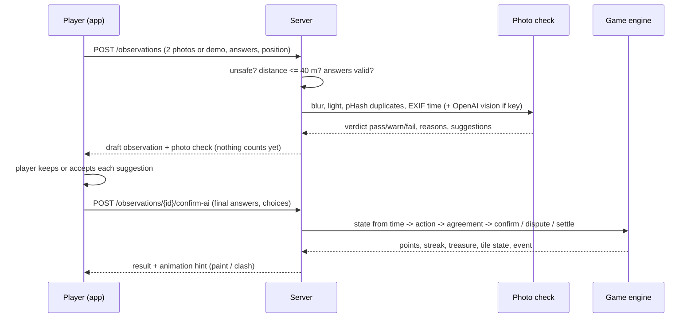

# Architecture

## Overview

```
streamrealm/
  app/        Expo SDK 57 app (TypeScript, expo-router). Web is the main target.
    src/app/          routes: (tabs)/map, kingdom, quests, leaderboard, profile,
                      onboarding, claim/[tileId], dashboard/
    src/components/   map/ (GameMap.web.tsx = MapLibre, GameMap.native.tsx = react-native-maps),
                      game/, ui/, dashboard/
    src/lib/          api.ts, store.ts (zustand), gameRules.ts, geo.ts (turf), theme.ts, sound.ts
  server/     FastAPI + SQLModel + SQLite
    app/routes/       world (cities, tiles, players), play (checks, storm, events),
                      social (quests, leaderboard, kingdom, stats), dashboard, export, dev
    app/services/     rules.py (all numbers), game.py (engine), ai_check.py, photos.py,
                      weather.py, bots.py, fhir.py, world.py, geo.py
    data/             cities.json, streams/*.geojson (raw OSM), tiles/*.geojson (game tiles),
                      experiment/coverage.json + .png, uploads/ (runtime)
    tests/            pytest
  scripts/    fetch_streams.py, build_tiles.py, simulate_coverage.py, smoke_test.py, screenshots.mjs
```

## Request flow of a stream check



Two steps on purpose: the player sees the photo check **before** anything counts, and the server stores both the original answers and the final answers, so "people vs AI" disagreement is measurable (dashboard KPI `suggestion_disagreements`, CSV columns `suggestions` and `suggestion_choices`).

## Data model (SQLModel)

`Player`, `Tile` (geometry, centre, `unsafe`), `TileState` (owner, last check, dispute sides, health, healing bonus), `Observation` (answers, original answers, photos, health, photo-check result, AI choices, status `draft|pending|confirmed|disputed|rejected`, action, outcome, points, confirmed_by), `Photo` (pHash index, only for checks that count), `Treasure`, `Quest`, `QuestProgress`, `Event` (activity feed).

Times are timezone-aware UTC. The game clock is `now + time_warp_days`; every read endpoint accepts `?time_warp_days=`.

## API (JSON)

- World: `GET /cities`, `GET /cities/{city}/tiles?time_warp_days=`, `GET /tiles/{id}`, `POST /players`, `GET /players/{id}`, `GET /players/{id}/stats`
- Play: `POST /observations` (multipart), `POST /observations/{id}/confirm-ai`, `GET /storm?city=`, `GET /events`
- Social: `GET /quests?player_id=`, `POST /quests/{id}/claim`, `GET /leaderboard?scope=week|all`, `GET /kingdom?player_id=`
- Dashboard: `GET /dashboard/kpis`, `GET /dashboard/disputes`, `POST /dashboard/disputes/{tile_id}/resolve`, `GET /dashboard/treasures`, `PATCH /dashboard/treasures/{id}`, `POST /dashboard/tiles/{id}/cleanup`, `POST /dashboard/tiles/{id}/unsafe`
- Export: `GET /export/csv`, `GET /export/geojson`, `GET /export/fhir`, `GET /experiment/coverage`, `GET /experiment/coverage.png`
- Dev: `POST /dev/reset`, `POST /dev/bots/tick`, `POST /dev/storm?on=true|false|auto`
- Interactive docs: `http://localhost:8000/docs`

## Maps

- **Web:** MapLibre GL JS 5 with the OpenFreeMap "positron" style, re-tinted at runtime to soft nature colours. If the style fails, it falls back to OSM raster tiles. Game layers: water-blue base line, glow for fresh tiles, dashed fog with a white "cloud" glow, pulsing fading and disputed tiles (requestAnimationFrame), white team patterns, a gold pulse on the claimable tile, a `line-gradient` "paint" animation along the line after a claim, and HTML markers for ⚔️ 💎 ⚠️ ✨ and the player.
- **Native:** react-native-maps polylines and markers with the same props (`components/map/types.ts`). Simpler, no animations.
- **Dashboard layers:** freshness (one-hue blue ramp: dark = just checked), health (diverging red - gray - blue), disputes, treasures. Ramps and the experiment chart palette were checked with a colour-blindness validator.

## Photo check (`services/ai_check.py`)

- Always on: blur (variance of the Laplacian, warn < 60), too dark (< 40) or bright (> 225), **re-used photo** (perceptual hash; distance ≤ 2 to any counted photo = **fail**, ≤ 8 = warn), EXIF capture time older than 24 h (warn; missing EXIF is normal for web uploads and is neutral), both photos identical (warn). A simple colour rule suggests the water colour at 35% confidence and says it is not AI.
- AI mode (only with `OPENAI_API_KEY`): both photos + the answers go to OpenAI (`gpt-6-luna` by default, Responses API, low reasoning effort) with a strict JSON schema (structured outputs). Suggestions are re-checked against the allowed values; smell is never suggested (you cannot smell a photo). Any error, refusal or timeout (8 s) → heuristic result, with `ai_error` noted.
- `fail` only for a re-used photo or "not a stream photo". Suggestions never change answers.
- Uploads are re-saved as JPEG **without EXIF** (GPS removed), max 1600 px.

## FHIR export

`GET /export/fhir` returns a FHIR R4 `Bundle` of type `collection`:

- one **`Location` per tile**: profile `http://hl7.eu/fhir/ig/oah/StructureDefinition/location-oah`, `identifier`, `name`, `mode = instance`, `position` (centre), the tile line as GeoJSON in the R4 core extension `http://hl7.org/fhir/StructureDefinition/location-boundary-geojson`, and a narrative.
- one **`Observation` per check**: `subject` → the Location, `effectiveDateTime`, `performer` (pseudonymous identifier), `category = survey`, a component per answer plus the game health score, and notes. When another player's check confirmed it, a note links to that Observation (a note, not `derivedFrom`, because the second check is not *derived from* the first).
  - **Confirmed** checks → `status = final` and profile `http://hl7.eu/fhir/ig/oah/StructureDefinition/observation-indicators-oah`.
  - **Unconfirmed** checks → `status = preliminary`, no profile claim (see gaps).
  - Demo data (bots, demo photos) → `meta.security` HL7 `v3-ActReason#HTEST` and a `synthetic-demo-data` tag.
- Components carry two codings where a concept exists in the OAH temporary code system `http://hl7.eu/fhir/ig/oah/CodeSystem/temporarySystem-oah-eu`: colour, smell and foam → `foam` "Foam/colour/smell"; flow → `hydrology` "Hydrology of the stream". Trash and overall feeling have no OAH concept and use local codes only.

**Where the URLs come from.** `build.fhir.org/ig/hl7-eu/oah/` returned 404 during the hackathon, so we read the IG source on GitHub (`hl7-eu/oah`, `input/fsh/profiles/*.fsh`, `sushi-config.yaml` with canonical `http://hl7.eu/fhir/ig/oah`) and compiled it with **SUSHI** (0 errors). The generated StructureDefinitions and CodeSystem have exactly the URLs above.

**Validation (HL7 FHIR validator `validator_cli.jar`, FHIR 4.0.1, no terminology server):**

| Run | Errors | Notes |
|---|---|---|
| Base R4 | **0** | Warnings: unknown local code systems, no terminology server. |
| With the OAH profiles compiled by SUSHI (`-ig oah/fsh-generated/resources`) | **0** | Information: the top-level code is not in the OAH indicator value set (binding is *preferred*, so this is allowed); the GeoJSON extension is not a named slice in `LocationOah` (allowed). |

Reproduce:

```bash
git clone --depth 1 https://github.com/hl7-eu/oah && (cd oah && npx fsh-sushi .)
curl -o bundle.json http://localhost:8000/export/fhir
java -jar validator_cli.jar bundle.json -version 4.0.1 -tx n/a -ig oah/fsh-generated/resources
```

**Gaps (honest):**

1. The IG has **no profile for citizen visual checks**. We used the indicators profile because its required elements fit, but a citizen-science profile would be better.
2. `ObservationIndicatorsOah` **fixes `status = final`**, which conflicts with unverified citizen data, so preliminary checks are plain R4 Observations.
3. Answer values (clear, brown, a little…) use our local `urn:streamrealm:answer` system. A shared OAH value set for visual assessments would make this interoperable.
4. Photos are not exported as FHIR resources yet (`DocumentReference` or `Media` would be next). The CSV has the photo paths.
5. The bundle uses our server URL as `fullUrl` base. It is a collection for exchange, not a FHIR server.

## Tests and checks

| What | Command | Result at hand-in |
|---|---|---|
| Server unit + API tests | `cd server && .venv/Scripts/python -m pytest -q` | 27 passed |
| Game rules (client) | `cd app && npx jest` | 17 passed |
| Types | `cd app && npx tsc --noEmit` | clean |
| Lint | `cd app && npx expo lint` | clean |
| Web build | `cd app && npx expo export --platform web` | builds |
| Android bundle | `cd app && npx expo export --platform android --no-bytecode` | builds (not run on a device) |
| API smoke test | `python scripts/smoke_test.py` (servers running) | all passed |
| Browser screenshots / e2e | `node scripts/screenshots.mjs` (needs Playwright) | 16 screenshots |
