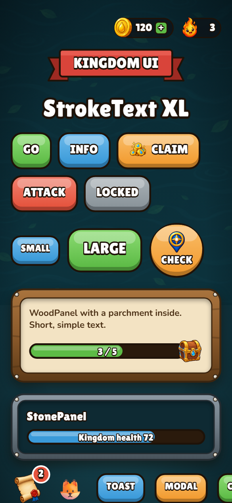
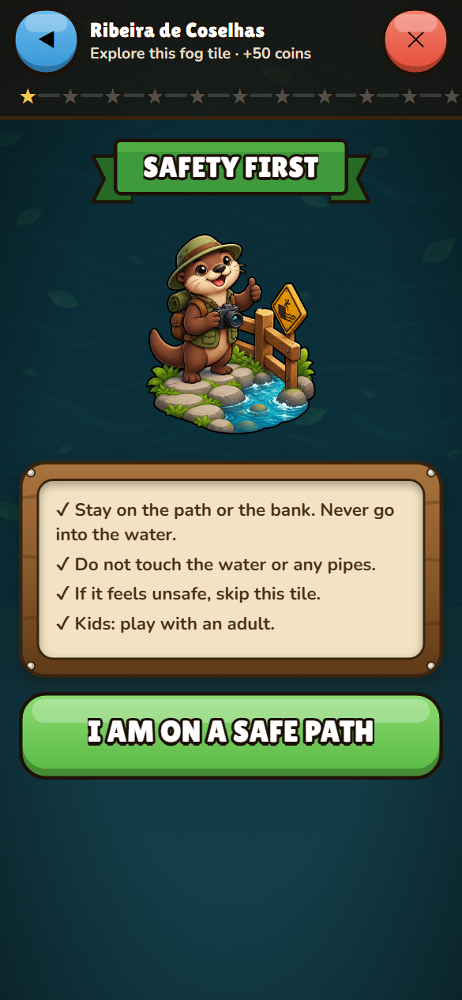
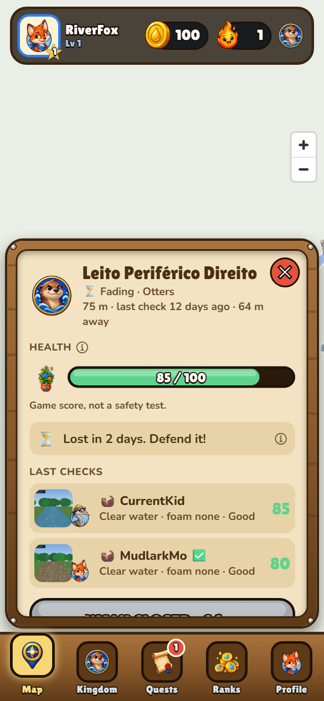
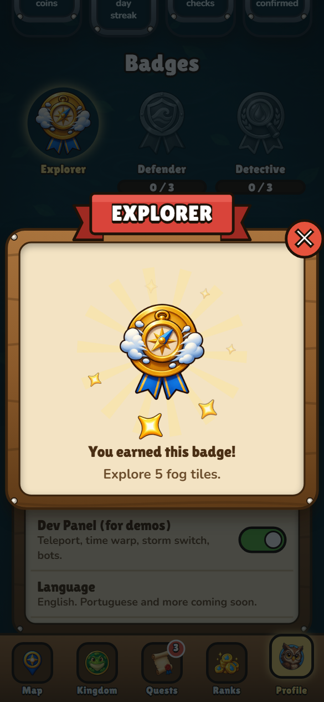
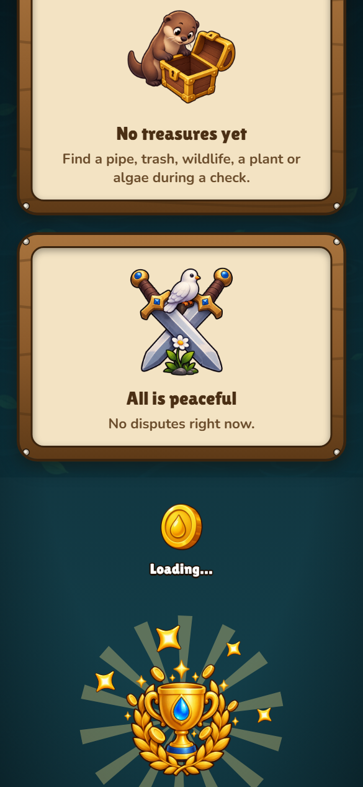

# Kingdom UI design system

The game screens use one small kit: wood, stone, parchment and gold on deep water teal, with chunky 3D buttons and bouncy motion. Visual style inspired by mobile strategy games; everything is drawn in code or comes from our own generated image pack. The scientist dashboard (`/dashboard`) does **not** use this kit on purpose.

Live showcase: open `http://localhost:8081/kit` (not linked from the game).

## Tokens (`app/src/theme/tokens.ts`)

| Group | Values |
|---|---|
| World | gradient `#0E2A33` → `#14404B`, water pattern at 30%, soft dark vignette |
| Wood | base `#8B5A2B`, light `#A8733D`, dark edge `#5E3A17`, outline `#3B240E` |
| Stone | base `#6E7B85`, light `#8C99A3`, dark `#47525A` |
| Parchment | `#F3E3C3`, text `#4A2F14` (contrast 9.7:1), muted text `#6A4C2B` (≥ 4.6:1 on both parchment tones) |
| Gold | `#F2C94C`, highlight `#FFE58A`, shadow `#B8860B` |
| Buttons (top / base / lip) | green `#8BDB72 / #5DBB46 / #458C34` (main), blue `#6CB9EA / #3A9AD9 / #2B73A3` (secondary), orange `#F9BE6A / #F29B30 / #B57424` (reward, claim), red `#F0806E / #E5533D / #AC3E2E` (danger, attack) |
| Teams | Otters `#2F80ED`, Frogs `#27AE60`, Kingfishers `#F2994A` |
| Text | white `#FFFFFF` with dark stroke `#1E1208` for titles and numbers. White on a light button colour alone is low (2.4:1 on green), so button labels always carry the thick dark outline, which is what separates them from the button. |
| Shape | radii 14 / 18 / 22, outlines 2-3 px, warm soft shadows |

Fonts (SIL Open Font License, via `@expo-google-fonts/*`): **Lilita One** for titles, numbers and button labels; **Nunito** 700/800 for body text (15 px minimum).

## Components (`app/src/components/kit/`)

| Component | What it is | Where |
|---|---|---|
| `StrokeText` | White text with a thick dark outline and drop shadow. Web: CSS `-webkit-text-stroke` + `paint-order`. Native: 8 offset copies. Sizes S/M/L/XL. | everywhere |
| `GameButton` | Gradient body, 5-7 px dark lip, glossy strip, outline. Press pushes the body into the lip (spring), scale 0.96, haptics on native. Colours green/blue/orange/red/disabled; sizes S, M, L, Round, RoundS. ≥ 48 px touch area. |  |
| `WoodPanel` / `StonePanel` | Wood frame with grain lines and rivets; parchment or dark-teal inside with an inner shadow. Stone variant for tablets. |  |
| `RibbonTitle` | Cloth banner (SVG folded ends) with stroke text. Red, blue, green. | screen titles, modals |
| `ResourcePill` | Dark pill, big overlapping icon, count-up number, icon bounce on change, idle shine, optional "+". The coin pill is the target for flying coins. | HUD, screens |
| `ChunkyProgress` | Thick outlined bar, moving shine stripe, centred "3 / 5", optional chest/star at the end. | quests, health |
| `RedBadge` | Red counter that pops in. | Quests tab, side button |
| `GameModal` | Dim backdrop, panel springs 0.6 → 1.05 → 1, ribbon title, round red ✕. |  |
| `RewardBurst` | Rotating SVG rays + popping `sparkle` images around a child. | victory, badges, team pick |
| `CoinFly` | 8-12 coins fly on curves to the coin pill; each landing counts up. | victory, quest chest |
| `Toast` (`ToastHost` + `useFx().toast`) | Wooden mini banner sliding down from the top. | quest rewards |
| `GameImage` | `expo-image` with the `Images` registry, `contain`, a11y label from `ImageAlt`, **emoji fallback** when the asset is missing or fails to load. | everywhere |
| `TabBar` | Wooden bar, square image buttons, active tab raised and glowing, red badge for ready quest rewards. | bottom tabs |
| `WorldBackground`, `GameScreen`, `CoinLoader`, `EmptyArt` | Screen background, screen wrapper with ribbon title and coin pill, spinning-coin loader, image empty states. |  |

## Motion

- `react-native-reanimated` springs (`app/src/theme/motion.ts`): press ≈ 80 ms, pops 250-350 ms with a small overshoot.
- Idle life: mascots breathe (1 → 1.03), the coin icon shines every few seconds, the quest chest wiggles when ready, the player marker pulses, the CHECK button glows.
- Only `transform` and `opacity` are animated (60 fps), no layout animation, no heavy blur on native.
- **Reduced motion:** `useMotionOK()` is false when the OS asks for it or the player turns on *Profile → Reduced motion*. Idle loops, ray rotation, sparkles and screen shake stop; simple fades stay. Measured on `/kit`: 1.47% of pixels change in 0.8 s with motion on, 3 pixels with it off.

## Map style (web)

Warm, simple base (OpenFreeMap positron re-tinted; POIs, shields and minor labels hidden; bright water, soft roads). Tiles are thick lines with a white casing; team patterns (solid / dots / dashes) so colour is never the only signal. Symbol layers use the image pack: pre-tinted team flags at zoom ≥ 15, fog clouds at low zoom, disputed / unsafe / healed markers, and treasure icons that cluster at low zoom. The player pin is the `marker-player` image with a code-drawn pulse ring.

## Images

52 source images (OpenAI GPT Image 2.5, our prompts) → `scripts/process_assets.py` → `app/assets/images/<group>/` + the generated registry `app/src/lib/assets.ts` (static `require()` for Metro, `ImageAlt`, `MISSING`). Shipped in the web build: **8.7 MB** of images (all densities). Report: `asset-source/report.md`. Contact sheet: [screenshots/contact-sheet.png](screenshots/contact-sheet.png).

### How to add a new image

1. Add an entry to `asset-source/assets.json`: `{ "id": "my-image", "group": "moments", "size": 512, "alt": "Short description" }`.
2. Put the transparent PNG in `app/assets/raw/my-image.png` (no chroma key; real alpha).
3. Run `python scripts/process_assets.py` (needs Pillow, numpy, scipy; pngquant comes with `npm install` in `app/`).
4. If it is a new kind of image, add its key to `write_registry()` in the script so it appears in `Images`.
5. Use it with `<GameImage src={Images.moment.myImage} fallback="✨" />`. If the file is ever missing, `MISSING` lists it and the emoji shows instead.

`python scripts/process_assets.py --registry-only` regenerates just the registry from the files on disk.
